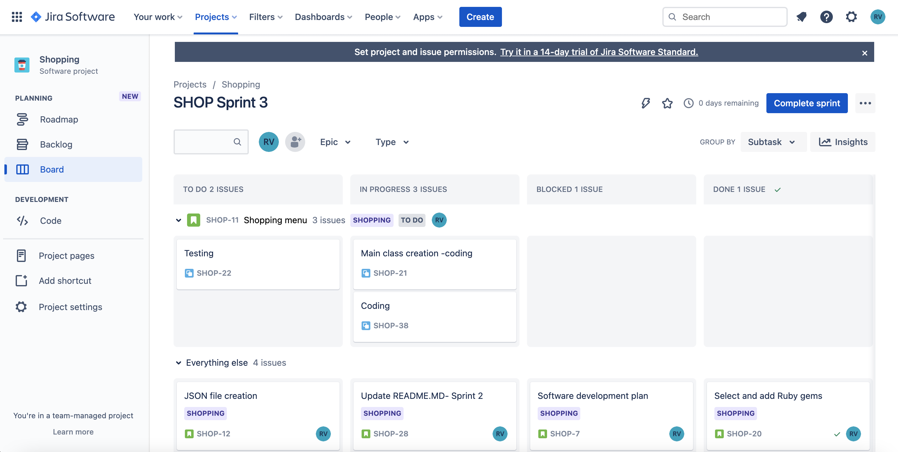

# Read me

## Source control repository

[GitHub Repository] (<https://github.com/RVArtist/Shopping_terminal_application>)

# Software development plan

## Statement of purpose

This terminal application can be used by a customer and store owner through a command line menu would be able to do the following actions.

- Show available products, prices and quantities available
- Able to select and add to cart
- Should be able to delete from cart
- Should be able to view the cart
- Should be able to do payment.
- Two modes should be there one for shop owner and another for customers
- Updating JSON file for price update and adding/deleting products in JSON  by the shop owner
- Errors like wrong input and wrong card number for payment should be displayed to the user

The customer would be able to see the menus like the below:

- View products
- Add product/products to cart
- Remove a product/products from cart
- Show my cart
- Proceed to payment

The shop owner would be able to see the menus like the below:

- Display products
- Change the price of a product
- Add a new product
- Delete an existing product

There would be a unique id for the user to select the related product.

## Scope

- User would be able to select/delete the quantities and multiple products at a time to and from the cart and do checkout
- Shop owner would be able to change the price of a product, add/delete a specific product or multiple products at once.
- Display JSON product list items to the customer and owner
- Differentiating master card and visa card would also be in scope

### Out of scope

Real payment would not be implemented(like connecting to bank API's) at this stage and only dummy payment successful should be displayed to customer.

Credit card validation is only to check the card type only

### Target audience

Anybody should be able to do the shopping. Shop owner also could be able to add/delete or change the price of product/products. Course educators to asses the skills ot basic Ruby programming and documentation.

### How the target audience will use this

As its an educational academic project, only educators will use it. But for documentation pupose the target audience could be customers and shop owner.

#### Customer

A customer should select the customer option from the main menu and the options will be displayed for the customer as explained in 'Statement of purpose' section and then he would be able to add/delete product/products to and from cart. Multiple products can be dealt with same operation. Customer would be able to do the dummy payment also. The menu options are super intuitive.

#### Shop owner

Shop owner should be able to select owner option from main menu and the options will be displayed for the customer as explained in 'Statement of purpose' section and then he would be able to add/delete product/products to and from the JSON file. He would be also able to change the price of a specific product or multiple products.

## THREE features

### Displaying the main menu and sub menu and ARGV

There is main while true loop which loop always which configures the application based on an if condition of either customer or shop owner is using the application. An error will be raised if wrong input is entered for user selection. The sub menu for customer and owner is also in a sub while true loop which will break to main loop as the transaction finishes so that either customer or owner could continue using the application.

ARGV is used to pass parameters while invoking the application like below:

`if ARGV.length > 0
    flag, *rest = ARGV
    ARGV.clear
    #flag.downcase
    case flag
    when '-help'
        tty_promt.ask("Please check readme file")
        exit
        #puts "Please check readme file"
    when '-info'
        puts "Written by Roby"
        exit
    else
        puts "Invalid input"
        exit
    end
end`

### Switcing between user menu items

Case.. when statements are used to differentiate between various functionalities or user selection. Depending on when calling object methods are extensively used in this application.

Array.each method is used to loop through the selected array elements

artii and tty_promt gems objects are above all loops and conditions, so it is accesible anywhere inside the file.

Other variables are specific to the control structure loike 'if' scope. That is not accesible outside the control structure.

### Classes and instance variables and class variables

There are 3 classes identified - Cart, Checkout and Product. Each class has gor methods related to that and methods has got specific functionalities.

There are instace variables with access specifiers for accessing that variables in objects of the class.

For example class Product has got 3 instance variables which are as below:

`@products = {}
        @tty_prompt = TTY::Prompt.new
@selected_products = []`

Their access specifiers are as below:

`attr_accessor :products, :tty_prompt, :selected_products`

Hash.each method is used as a control structure to loop through and do a block for hashes

`@products.each do |key, value|
            table << value
        end
        puts table.render(:ascii)`

## User interaction

### How the user will find out how to interact with / use each feature

The main menu and costomer/owner specific menu is very intuitive. Select either one of those or exit to exit the application. Exiting from the application can only be done through exit in main menu.

The customer would be able to see the menus like the below:

- View products
  - Customer would be able to see all the products available in the store with it'd unit price and stock availability in a table format.
- Add product/products to cart
  - Customer would be able to select multiple products at once from the multi selection list.
  - Then user would be prompted with quantity selection for each product selected.
- Remove a product/products from cart
  - Customer would be able to select multiple products at once from the multi selection list to remove from cart.
  - Then user would be prompted with quantity selection to delte for each product selected or delete a whole line of product.
- Show my cart
  - Customer would be able to see the cart with all the products selcted with its quantity, unit price, line total and subtotal of all the products
- Proceed to payment
  - Customer would be able to see the total amount to be paid.
  - Cash payment and card payment available
  - If you overpay you would balance back.
  - Visa and Master cards are distuinguishable.
  - Card payment should enter dummy expiry dates and CVV.
  - Finally payment accepted message and bye message is shown

The shop owner would be able to see the menus like the below:

- Display products
  - Shop owner would be able to see all the products available in the store with it'd unit price and stock availability in a table format.
- Change the price of a product
  - Owner would be able to change the price of multiple products or singlr product at a time by selecting the products from the selectable list showm.
  - Then he would be able to enter the new price for each item selected succecively
  - These changes are refelected in JSOn file also.
- Add a new product
  - Owner would be able to add new product by entering product name, price and stock available values when promted by console.
  - These new product is updated to the products JSON file also.
- Delete an existing product
  - owner would be able to delete a specific product or multiple products from the Hash object and JSON file, just by selcting the list of products from the product selectable list.

## Control flow of application

## Control flow chart

## Implementation plan

[Jira scrum] (<https://rvartist.atlassian.net/jira/software/projects/SHOP/boards/1>)

### Screenshot of Jira scrum board

## How to use and install the application

1. Set executable permissions to run shell scripts
2. Run install-dependencies.sh

- This would install the following gems included in Gemfile.

`gem "rspec", "~> 3.10"

gem "colorize", "~> 0.8.1"

gem "tty-prompt", "~> 0.23.1"

gem "artii", "= 2.1"

gem "tty-table", "~> 0.12.0"`

3. Run run.sh

## Test Report

Test report is in ./docs/Test_cases.xlsx file
